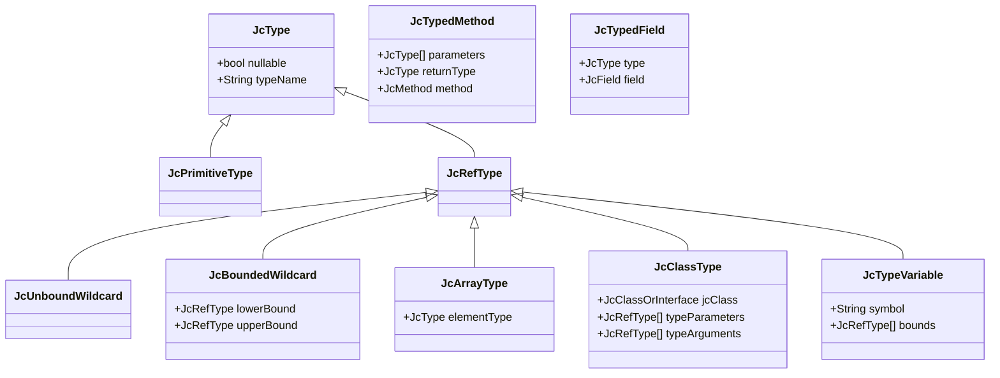

## Settings

JCDBSettings is used for creating instance of `JCDB` instance.

#### `useJavaRuntime(file)`

Use custom (not current process) java runtime for bytecode analysis.

There are two shortcuts `JCDBSettings#useProcessJavaRuntime` for using current process runtime (default option) and `JCDBSettings#useJavaHomeRuntime` for using Java runtime from JAVA_HOME environment variable


| parameter | type | description                           |
|-----------|------|---------------------------------------|
| runtime   | File | Required. File points to java runtime |


#### `persistent(location, clearOnStart)`

Specify storing data properties

| parameter    | type     | description                                                                                                  |
|--------------|----------|--------------------------------------------------------------------------------------------------------------|
| location     | string   | Optional. Location on file system to store Sqlite database file. Sqlite will be in-memory if null specified |
| clearOnStart | boolean  | Force Sqlite database to cleanup stored data on startup. false by default                                    |


#### `loadByteCode(files)`

Which files to load on startup

| parameter | type            | description                             |
|-----------|-----------------|-----------------------------------------|
| files     | list of `File`  | jars or folders with compiled java code |


#### `watchFileSystem()`

Should database look for filesystem changes

| parameter | type    | description                                                         |
|-----------|---------|---------------------------------------------------------------------|
| delay     | integer | Optional. 10_000 by default. Watch interval for file system changes |

#### `installFeatures(features)`

Which features jcdb will use

| parameter | type                | description                                                          |
|-----------|---------------------|----------------------------------------------------------------------|
| features  | Array of JcFeatures | List of features. Features cannot be installed after jcdb is created |


## Database

`JCDB` instance created based on settings. If instance is not needed yet then `close` method should be called.

#### Properties

| property       | type                         | description                                                    |
|----------------|------------------------------|----------------------------------------------------------------|
| locations      | List of `JcByteCodeLocation` | List of locations processed by database                        |
| persistence    | `JCDBPersistence`            | persistence which brings ability to read/write to database     |
| runtimeVersion | `JavaRuntimeVersion`         | version of java runtime which is used for this `jcdb` instance |


#### `classpath(dirOrJars)`

Creates classpath instances

| parameter  | type            | description                                                  |
|------------|-----------------|--------------------------------------------------------------|
| dirOrJars  | List of `File` | List of files with bytecode to be loaded in current instance |


#### `refresh()`

Refreshes state of `jcdb` instance and state of file systen. Should be called to clean up jars/folders that loaded versions are out of data and which are not used by any classpaths created by `jcdb` instance

#### `rebuildFeatures()`

Rebuild indexes for features installed in `jcdb`

#### `awaitBackgroundJobs()`

Await background jobs

#### `close()`

Is used to clean up resources used by `jcdb` instance

## Classpath


### Properties

#### Properties

| property  | type                          | description                             |
|-----------|-------------------------------|-----------------------------------------|
| locations | List of `JcByteCodeLocation`  | List of locations attached to classpath |
| db        | `JCDB`                        | database instance                       |


findClassOrNull(name: String): JcClassOrInterface?

#### `findClassOrNull(name)`

Find class with bytecode (i.e arrays, primitives are not supported by this method).

| parameter | type   | description                            |
|-----------|--------|----------------------------------------|
| name      | string | name of the class (`java.lang.String`) |

#### `findTypeOrNull(name)`

Find type by name. Arrays, primitives are supported:
- arrays have [] in the end like `java.lang.String[]`
- primitive has human readable names (checkout `PredefiendPrimitives`)

| parameter | type   | description                                                        |
|-----------|--------|--------------------------------------------------------------------|
| name      | string | name of the type (`java.lang.String[]`, `int` or `java.util.List`) |

## Classes


### `JcClassOrInterface`
Represent bytecode from `.class` file

| property        | type                         | description                                |
|-----------------|------------------------------|--------------------------------------------|
| classpath       | `JcClasspath`                | classpath                                  |
| access          | int                          | access flag of class                       |
| name            | string                       | human readable class name                  |
| simpleName      | string                       | simple name                                |
| signature       | string                       | signature from bytecode                    |
| declaredFields  | List of `JcField`            | List of declared fields                    |
| declaredMethods | List of `JcMethod`           | List of declared methods                   |
| isAnonymous     | boolean                      | is anonymous class                         |
| superClass      | `JcClassOrInterface`         | super class or null for `java.lang.Object` |
| interfaces      | List of `JcClassOrInterface` | interfaces                                 |
| outerMethod     | `JcMethod`                   | outer method if any                        |
| outerClass      | `JcClassOrInterface`         | outer class if any                         |
| innerClasses    | List of `JcClassOrInterface` | inner classes if any                       |
| annotations     | List of `JcAnnotation`       | list of annotations                        |

#### `bytecode()`

return ASM ClassNode for this class

### `JcMethod`

Represent method of `JcClassOrInterface`

| property        | type                         | description                             |
|-----------------|------------------------------|-----------------------------------------|
| enclosingClass  | `JcClassOrInterface`         | enclosing class                         |
| access          | int                          | access flag of method                   |
| name            | string                       | human readable class name               |
| signature       | string                       | signature from bytecode                 |
| description     | string                       | jvm description of method               |
| returnType      | string                       | string with return type name            |
| parameters      | List of `JcParameter`        | parameters                              |
| exceptions      | List of `JcClassOrInterface` | exceptions that can be throws by method |
| annotations     | List of `JcAnnotation`       | list of annotations                        |

#### `bytecode()`

return ASM MethodNode for this method

### `JcField`

Represent field of `JcClassOrInterface`

| property       | type                 | description                    |
|----------------|----------------------|--------------------------------|
| enclosingClass | `JcClassOrInterface` | enclosing class                |
| access         | int                  | access flag of method          |
| name           | string               | human readable class name      |
| signature      | string               | method signature from bytecode |
| type           | string               | string with type of field      |
| annotations    | List of `JcAnnotation`       | list of annotations                        |

### `JcParameter`

Represent method parameter

| property    | type                   | description                     |
|-------------|------------------------|---------------------------------|
| method      | `JcMethod`             | enclosing method                |
| access      | int                    | access flag of method           |
| name        | string                 | parameter name of present       |
| type        | string                 | string with parameter type name |
| index       | int                    | index of parameter in method    |
| annotations | List of `JcAnnotation` | list of annotations             |

### `JcAnnotation`

Represent annotation

| property | type                 | description                                          |
|----------|----------------------|------------------------------------------------------|
| jcClass  | `JcClassOrInterface` | annotation class. may be null                        |
| visible  | boolean              | access flag of method                                |
| values   | Map<String, Object>  | values of annotation according to java specification |


#### `matches(className)`

Return true if className equals annotation class.

## Types



### `JcClassType`

| property         | type                    | description                                    |
|------------------|-------------------------|------------------------------------------------|
| classpath        | `JcClasspath`           | classpath                                      |
| jcClass          | `JcClassOrInterface`    | class                                          |
| name             | string                  | human readable class name                      |
| typeArguments    | List of `JcRefType`     | generics substitution                          |
| declaredFields   | List of `JcTypedField`  | List of declared typed fields                  |
| declaredMethods  | List of `JcTypedMethod` | List of declared typed methods                 |
| fields           | List of `JcTypedField`  | all visible typed fields from whole hierarchy  |
| methods          | List of `JcTypedMethod` | all visible typed methods from whole hierarchy |
| superType        | `JcClassType`           | super class or null for `java.lang.Object`     |
| interfaces       | List of `JcClassType`   | interfaces                                     |
| outerMethod      | `JcMethod`              | outer typed method if any                      |
| outerType        | `JcClassType`           | outer type if any                              |
| innerType        | List of `JcClassType`   | inner types if any                             |

### `JcTypedMethod`

Represent typed method of `JcClassType`

| property         | type                        | description               |
|------------------|-----------------------------|---------------------------|
| name             | string                      | human readable class name |
| returnType       | `JcType`                    | return type name          |
| typeParameters   | List of `JcTypedParameter`  | list of typed parameters  |
| typeArguments    | List of `JcRefType`         | generics substitution     |
| enclosingType    | `JcClassOrInterface`        | enclosing type            |

### `JcTypedField`

Represent field of `JcClassType`

| property        | type             | description               |
|-----------------|------------------|---------------------------|
| field           | `JcField`        | enclosing field           |
| name            | string           | human readable class name |
| type            | `JcType`         | type of field             |
| enclosingType   | `JcClassType`    | enclosing type            |

### `JcTypedParameter`

Represent typed method parameter

| property | type       | description                     |
|----------|------------|---------------------------------|
| method   | `JcMethod` | enclosing method                |
| name     | string     | parameter name of present       |
| type     | `JcType`   | parameter type                  |


## Features

`JcFeature` is an additional feature which can collect data from bytecode, persist it in database and use it to find some specific places.
`JcFeature` has parameterization of request/response types.

### `JcFeature`

Lifecycle of feature: 
- before indexing step. Can be used for preparing database scheme or similar
- indexing
- flushing indexed data to persistence storage
- after indexing step. Can be used to setup database specific indexes.
- update index if bytecode location is outdated and removed.

#### `onSignal(signal)`

Call on each step of lifecycle with respected signal

| property | type       | description                                                         |
|----------|------------|---------------------------------------------------------------------|
| signal   | `JcSignal` | on of `BeforeIndexing`, `AfterIndexing`, `LocationRemoved`, `Drop`  |


#### `newIndexer(jcdb, location)`

return new indexer for specific location

| property | type                 | description                     |
|----------|----------------------|---------------------------------|
| jcdb     | `JCDB`               | database                        |
| location | `RegisteredLocation` | location that should be indexed |

#### `query(classpath, request)`

Query index and return `Sequence` with results

| property  | type           | description      |
|-----------|----------------|------------------|
| classpath | `JcClasspath`  | classpath        |
| request   | Any            | request to index |


### `ByteCodeIndexer`

Indexer of bytecode. 

#### `index(node)`

Called for each ClassNode processed by `jcdb`. **Bytecode locations are processed in parallel. There is no strict order of processing locations.** 

| property | type        | description                             |
|----------|-------------|-----------------------------------------|
| node     | `ClassNode` | ASM class node with method instructions |

#### `flush(jooq)`

Flush collected data for location into storage

| property | type         | description                                                              |
|----------|--------------|--------------------------------------------------------------------------|
| jooq     | `DSLContext` | [Jooq](https://www.jooq.org/) - orm framework used by persistence engine |

## Available features 

### Hierarchy

Suitable for search class hierarchies. There are two features for calculating hierarchy: one is build upon persistence of bytecode another one uses (small enough) in-memory tree called InMemoryHierarchy.

#### `findSubClasses(jcClass,allHierarchy)`

Finds all classes in Classpath that are subclasses of `jcClass`

| parameter    | type                                | description                                 |
|--------------|-------------------------------------|---------------------------------------------|
| jcClass      | `JcClassOrInterface` or class name  | base class                                  |
| allHierarchy | boolean                             | if true then will be return whole hierarchy |

#### `findOverrides(method)`

Finds all methods in Classpath that override specified method

| parameter     | type          | description                         |
|---------------|---------------|-------------------------------------|
| method        | `JcMethod`    | base method to search for overrides |

#### Examples

find classes that implements `java.lang.Runnable`:

```kotlin
    val jcdb = jcdb {
        loadByteCode(allClasspath) // all classpath for current process
        installFeatures(InMemoryHierarchy) // without that line memory footprint will be low as well as performance
    }
    val classpath = jcdb.classpath(allClasspath)
    val extension = classpath.hierarchyExtension()
    extension.findSubClasses("java.lang.Runnable", allHierarchy = true) // all classes that implements `Runnable`
    
    val runMethod = classpath.findClassOrNull("java.lang.Runnable")!!.declaredMethods.first() // find run method
    extension.findOverrides(runMethod, allHierarchy = true) // all implementations of `Runnable#run` method
```

### Usages (aka Call Graph)

Suitable to find fields and methods usages.


#### `findUsages(method)`

Finds usages of `method` in `JcClasspath`

| parameter    | type        | description              |
|--------------|-------------|--------------------------|
| method       | `JcMethod`  | method to search usages  |


#### `findUsages(field, mode)`

Finds usages of `field` in `JcClasspath`

| parameter | type      | description                             |
|-----------|-----------|-----------------------------------------|
| field     | `JcField` | base method to search for overrides     |
| method    | enum      | search for `READ`s or `WRITE`s of field |


#### `findInstantiations(jcClass)` TBD

Finds all methods that instantiate instance of specified class

| parameter  | type                   | description                |
|------------|------------------------|----------------------------|
| jcClass    | `JcClassOrInterface`   | class to search            |

### Examples

find usages of 
```kotlin
    val jcdb = jcdb {
        loadByteCode(allClasspath) // all classpath of current process
        installFeatures(Usages, InMemoryHierarchy) // without that line memory footprint will be low as well as performance
    }
    val classpath = jcdb.classpath(allClasspath)
    val extension = classpath.usagesExtension()
    
    val runMethod = classpath.findClassOrNull("java.lang.Runnable")!!.declaredMethods.first() // find run method
    extension.findUsages(runMethod) // all implementations of `Runnable#run` method

    val systemOutField = cp.findClass("java.lang.System").declaredFields.first { it.name == "out" }
    val result = ext.findUsages(systemOutField, FieldUsageMode.READ).toList()
```

### Builders

Find methods that may be used for created particular class instance with priorities.
Heuristics used for this feature:
- public method
- method return type should be directly this class or one of subclasses
- method parameters should not reference this class in any way (i.e we are looking for class A, then A, List<A>, B extends A are prohibited)

Priorities are:
- static class with no parameters
- static class with parameters
- non-static class with name `build`
- all other

#### Examples

```kotlin
    val extension = classpath.buildersExtension()
    // find potential for instantiate DOM DocumentFactory builders
    //javax.xml.parsers.DocumentBuilderFactory#newInstance method will be in top of the list
    extension.findBuildMethods(classpath.findClass<DocumentBuilderFactory>()).toList()
```


