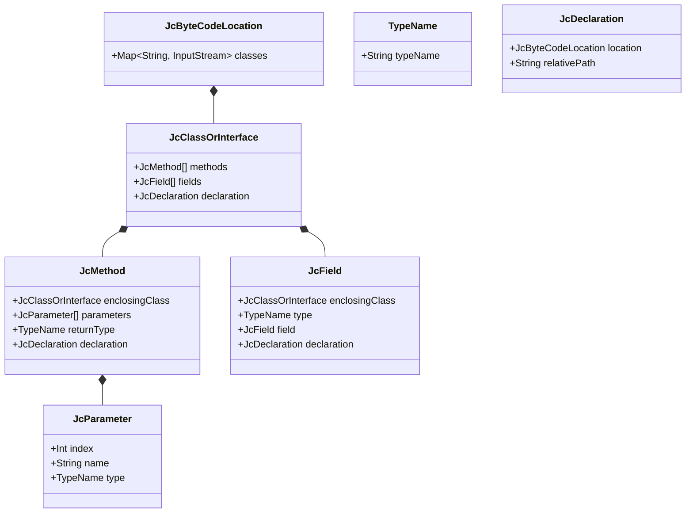
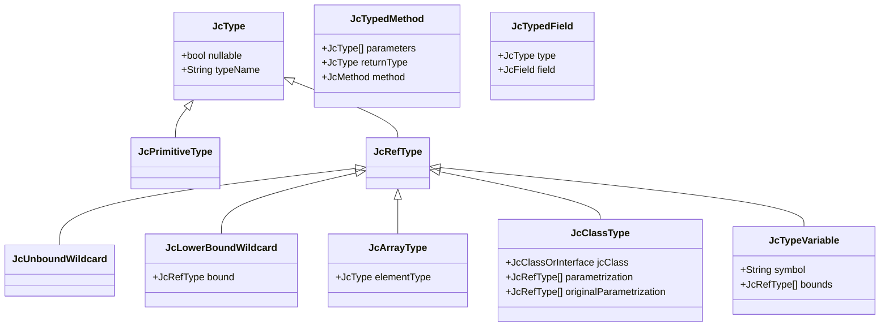
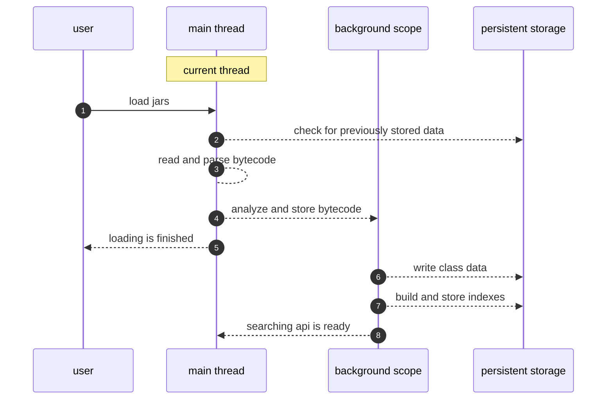
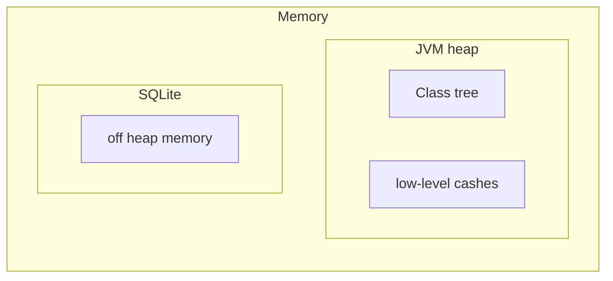

# Requirements

Java Compilation Database is a library which stores information about Java byte-code located outside the JVM process. Like `Reflection` do this for runtime Java Compilation Database is doing this for byte-code stored somewhere in file system.

This is basic requirements for database implementation: 

* async and thread-safe api
* each database instance is binded to Java runtime version up from 1.8 
* bytecode processing and analyzing up from Java 1.8
* ability to update bytecode from location without breaking already processed data
* ability to persist data on-disk and reuse it after application restart
* fast startup: `jcdb` should balance between returning instance as soon as possible and fast operations of querying data from database
* ability to extend api

## API basics

Bytecode has two representations in filesystem (classes) and in runtime (types).

**classes** - represents data from `.class` files as it is. Each class file get parsed with ASM library and represented as ASM ClassNode
**types** - represent types which can be nullable, get parameterized etc.

Both of levels connected to `JcClasspath` to avoid jar-hell. If **classes** retrieved from pure bytecode you can't modify them or construct something. **types** work in a different way. They may be constructed manually based on generic's parameterization.   

**Classes**

**Types** hierarchy

Entry point for both of them is `JcClasspath`

## Loading bytecode

It's intended that bytecode of Java runtime is not changed and is read on startup along with bytecode of `predefined` bytecode locations.

Loading of bytecode:

## Memory usage

Application uses in-memory `ClassTree` for classes that are in loading state. When classes are loaded, analyzed and persisted in database data from `ClassTree` is evicted. 
Pure bytecode is stored in underling database as well. Underling database is using off heap memory.

`JcClasspath` represents the set of classpath items with bytecode. `JcClasspath` should be closed after it becomes unused. This reduces usage of outdated bytecode locations and cleanup data from them. Which means that each class should be presented once there. Otherwise, in case of collision like in jar-hell only one random class will win.

# Extension points

## Features

`Features` should be added on database startup. No additional feature could be added after. `Feature` could store information in database and extend basic api based on this data. It's expected that `Feature` uses database for storing data.

## Hooks

Compilation database can be extended with hooks. Hook is an environment extension with brings ability to implement remote api or call specific code during database lifecycle. 

Hook is called twice: after called twice when database is created and initialized properly and when it is closed.