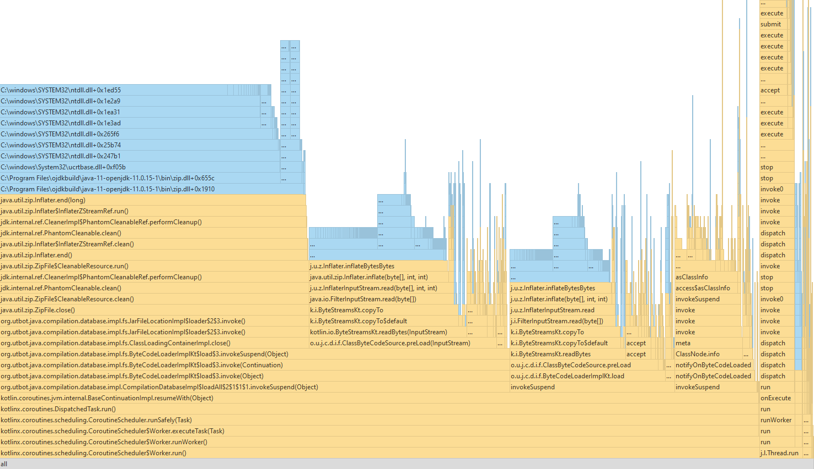

# Requirements

Java Compilation Database is a pure Java database which stores information about Java compiled byte-code located outside
the JVM process. Like `Reflection` do this for runtime Java Compilation Database is doing this for byte-code stored
somewhere in file system.

This is basic requirements for database implementation: 

* async and thread-safe api
* each database instance binded to Java runtime version greater than 1.8 
* bytecode processing and analyzing up from Java 1.8
* ability to update bytecode from location without breaking already processed data
* ability to persist data on-disk and reuse it after application restart
* fast startup: `compilationDatabase` factory method should balance between returning instance as soon as possible and fast operations of querying data from database
* ability to extend querying api by indexes

# Architecture

Application lifecycle parts: 
* initialization and reading bytecode
* in-memory tree storage
* indexes based on bytecode
* persistence for data and indexes.

## Initialization and reading bytecode

It's intended that bytecode of Java runtime is not changed and is read on startup along with bytecode of `predefined` bytecode locations.

Reading of bytecode splits into two steps:
* sync step: all classes files are read from jars/folders and only bytecode of some classes are processed  
* async step: all bytecode is processed. Done in a background

When first step is done database is treated as initialized and it's instance becomes available. Some api calls may wait till step 2 is done. This scheme brings balance for call simple api in a fast way.  
In the end of second async step database triggers event for setup indexes for new or updated locations. 

## Class tree

`ClassTree` is in-memory storage of classes from **all** bytecode locations organized in tree structure based on package names and location identifiers. `ClassTree` is not serializable and caches ASM structures based on bytecode.  
`ClassTree` by design uses lock-free collections for storing data. In case of persistent scheme part of data retrieved from underling persistent store other data retrieved from jar files itself.

`ClasspathSet` represents the set of classpath items. `ClasspathSet` limits `ClassTree` based on its locations. `ClasspathSet` should be closed after it becomes unused. This reduces usage of outdated bytecode locations and cleanup data from them. Which means that each class should be presented once there. Otherwise, in case of collision like in jar-hell only one random class will win.

## Indexes

Each bytecode location may have number of indexes (like parent classes index etc). Index is identified by index key. Indexes should be not aware of `ClassTree` and bytecode itself. Index should hold only serializable data optimized by memory consumption. 

## Persistence

To Be Done

# Implementation details

## IO

About 80% of initialization time consumed by IO from file system in reading jar-file content or class-file content.

Splitting bytecode processing into sync/async step gives performance improvement for startup. For example Java 1.8 rt.jar contains about 60mb of compressed bytecode.
Main idea is to scan runtime locations depending on basic usage rules. Not so many applications using classes from `org.w3c.dom.*` or `jdk.*` packages. The idea is to move processing bytecode of rarely used classes to async step and release database instance faster. 

## Performance

`ClassTree` uses immutable lock-free structures from [Xodus database](https://github.com/JetBrains/xodus). This brings 10% lower memory footprint of application (`CompilationDatabaseImpl` created only with Java 8 runtime consumes about ~300Mb of heap memory). `ClassTree` implementation based on java concurrent collections consumes ~330Mb of memory.
Initialization performance is almost the same between Xodus-structures and java concurrent structures.