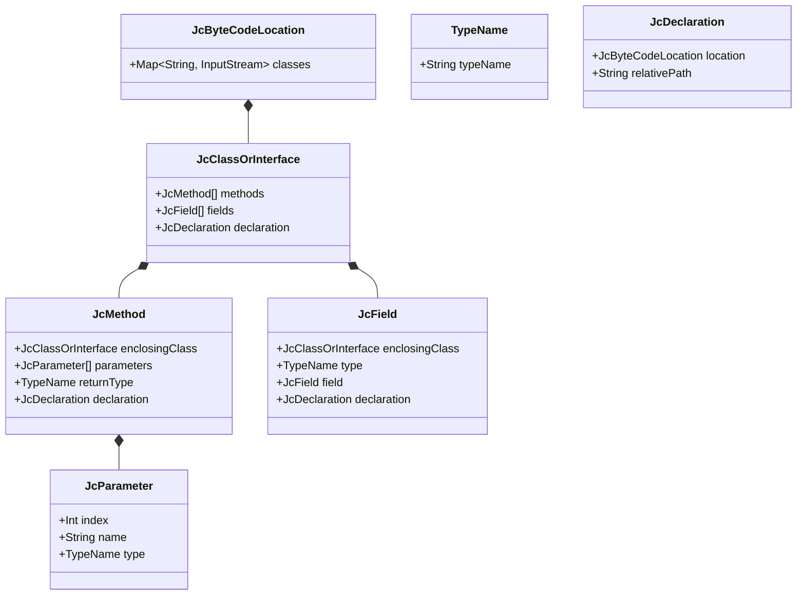
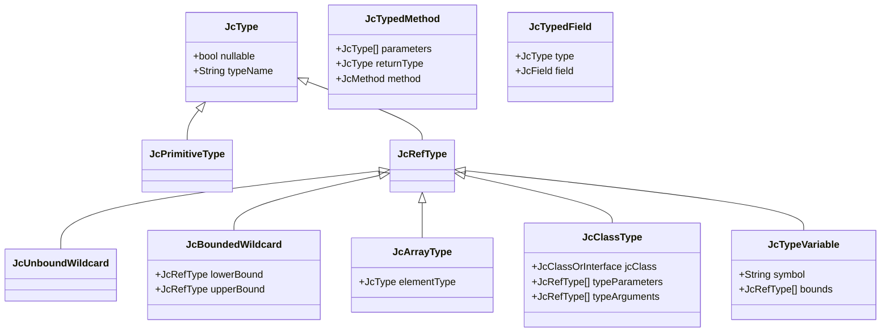
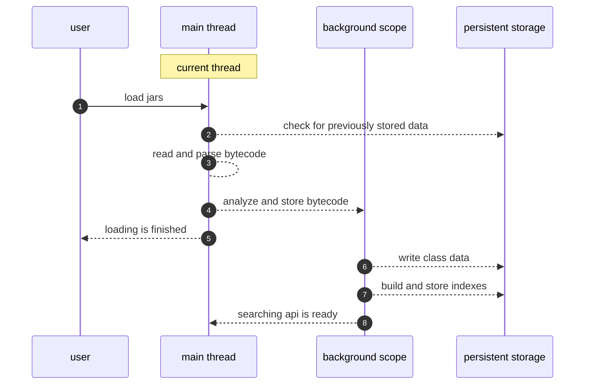
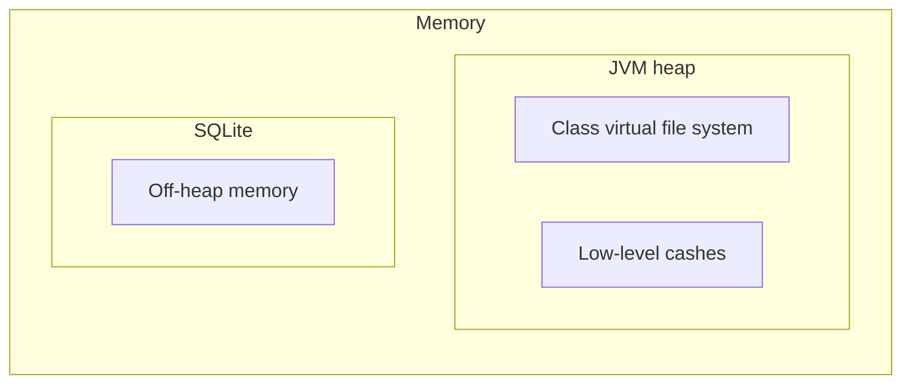

# Requirements

Java Compilation Database is a library that allows you to get information about Java bytecode outside the JVM process and to store it in a database. While Java `Reflection` makes it possible to inspect code at runtime, Java Compilation Database does the same for bytecode stored in a file system.

These are basic requirements for database implementation:

* asynchronous, thread-safe and extendable API
* binding each database instance to a specific Java runtime version (starting with Java 1.8)
* bytecode processing and analyzing (starting with Java 1.8)
* an ability to update bytecode from the given location while keeping the processed data intact
* an ability to persist data on a disk and to reuse it after restarting the application
* fast start-up: `JacoDB` should balance between returning instance as soon as possible and querying data from database in the fastest way

## API basics

Bytecode has two representations: the one stored in filesystem (**classes**) and the one appearing at runtime (**types**).
* **classes** — represent data from `.class` files as is. Each `.class` file is parsed with ASM library and represented as ASM `ClassNode`.
* **types** — represent types that can be nullable, parameterized, etc.

Both levels are connected to `JcClasspath` to avoid JAR hell.
You can't modify **classes** retrieved from pure bytecode. **types** may be constructed manually by parameterizing generics. 

**Classes**

**Types** hierarchy

`JcClasspath` is an entry point for both **classes** and **types**.

`JcClassType#methods` contains:

* all the public/protected/private methods of an enclosing class
* all the ancestor methods visible at compile time
* only constructor methods from the declaring class

`JcClassType#fields` contains:

* all the public/protected/private fields of an enclosing class
* all the ancestor fields visible at compile time

## Loading bytecode

Bytecode at Java runtime is not supposed to be changed. It is read at start-up along with the bytecode obtained from the `predefined` bytecode locations.

Bytecode loading:

## Memory usage

Application uses in-memory `ClassTree` for the classes being loaded. When **classes** are loaded, analyzed and persisted to a database, the corresponding data is deleted from `ClassTree`. Pure bytecode is stored in the same database, which uses off-heap memory.

`JcClasspath` represents the set of `classpath` items with bytecode. `JcClasspath` should be closed as soon as it becomes needless. This reduces usage of outdated bytecode locations and cleans out data from them. Each class should be presented once in this set. Otherwise, in case of collision, like in JAR hell, only one random class could win.

# Extension points

## Features

All `JcFeature` extensions should be added at database start-up — it is impossible to add features later.  `JcFeature` can store additional information in database and extend the basic API accordingly.

## Hooks

One can extend `JacoDB` with hooks. Hook is an environment extension which allows for implementing the remote API or calling the specific code during the database lifecycle.

Hook is called twice: when the database is created and initialized properly and when it is closed.